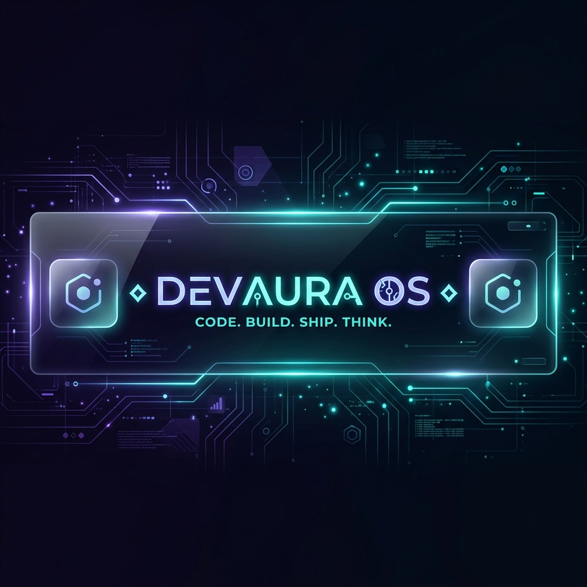
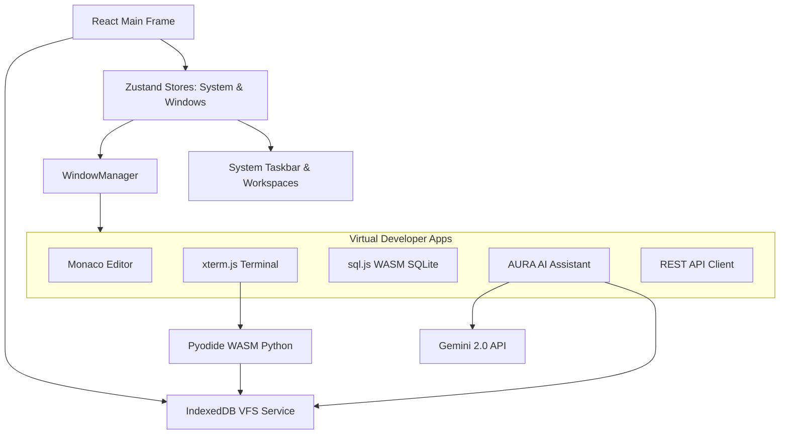

# ⬡ DEV AURA OS



> **Code. Build. Ship. Think.**  
> DEV AURA OS is a premium, web-native developer operating system. It unifies your terminal, code editor, browser, databases, API client, and an advanced Gemini-powered AI co-developer into a single, cohesive, glassmorphic desktop environment. 

---

## ⚡ Tech Stack & Badges

[](#)
[](#)
[](#)
[](#)
[](#)
[](#)
[](#)
[](#)

---

## ⬡ The DevAura Visual Experience

Designed to resemble a state-of-the-art developer desktop, DevAura OS implements a modern, premium design system with custom HSL color styling, smooth interactive spring-physics transitions, and dark/light modes.

### 🌟 Premium Features:
- **Pointer-Tracking Aura Glow**: Interactive desktop buttons, taskbar shortcuts, tray items, and window borders automatically calculate mouse coords and render a dynamic, glassmorphic neon aura lighting effect.
- **Multi-Workspace Dock**: Effortlessly swap workspaces using the built-in system taskbar switcher, keeping your development window layouts perfectly organized.
- **Boot Sequence Loading**: Initialized via a rich cinematic console boot sequence that tests and mounts a browser-native virtual file system (VFS).

---

## 📁 15 Powerful Built-In Applications

DevAura OS is fully packed with 15 specialized developer applications, each engineered to execute entirely client-side:

### 1. ◆ AURA AI (Workspace Co-Developer)
A highly advanced AI co-developer powered by the `Gemini 2.0 Flash` model.
- **Full Context Awareness**: Seamlessly scans your entire browser-based Virtual File System (VFS) and tracks the active Monaco text editor tab to provide hyper-focused code completions and refactoring.
- **Automated Workspace Syncing**: If AURA generates code enclosed in a `<write_file path="...">` tag, DevAura OS automatically writes or updates the corresponding file inside the IndexedDB VFS on-the-fly and triggers an OS-wide VFS-sync notification.
- **Slash Commands**: Supported macros include `/explain`, `/refactor`, `/debug`, `/generate`, `/test`, and `/docs`.

### 2. ▶ Terminal (ANSI Shell & WASM Runtimes)
A multi-tab terminal emulator built on `xterm.js` that mirrors standard shell environments.
- **Simulated Unix Shell**: Native implementation of `ls`, `cd`, `pwd`, `mkdir`, `cat`, `echo`, `clear`, `neofetch`, simulated `git` and `npm`, and file output redirection (`echo hello > test.js`).
- **Sandboxed JavaScript (`node`)**: Runs scripts and a simulated Node REPL inside an isolated Web Worker sandbox with overridden console logs.
- **WASM Python REPL & Script Executor (`python`)**: Downloads and boots the `Pyodide` WASM Python runtime, **automatically mirroring** your IndexedDB files into Python's virtual memory FS so python scripts can load/import local files seamlessly.

### 3. ◈ Code Editor (VS Code Engine)
A full-featured IDE interface driven by the **Monaco Editor**.
- Multi-file tab routing.
- Responsive, collapsible sidebar file explorer tree.
- Full syntax highlighting, auto-indentation, and keymap support.
- Directly synced with the virtual database store, enabling hot-saves.

### 4. 🗄 Database Explorer (SQLite Client)
An interactive SQLite workspace built on `sql.js` (SQLite WASM).
- Complete visual database browser showing schema tables, columns, rows, and indexes in a dedicated sidebar.
- Import/Export standard `.db` SQLite binaries directly in the browser.
- Glowing query runner with structured grids displaying results.

### 5. ⇆ API Client (REST Workspace)
A robust Postman/Insomnia client built to test REST endpoints.
- Supports GET, POST, PUT, DELETE, and PATCH methods.
- Dynamic key-value grids to construct headers and request URL query parameters.
- Response meta-inspector tracking status codes, request latency in milliseconds, and content sizing.
- Clean JSON formatting with glowing text preview and CORS failure diagnostics.

### 6. 📁 Files (IndexedDB Virtual File System)
A custom desktop explorer managing files and directories stored in IndexedDB.
- List view and grid layouts.
- Right-click context menus to create, rename, or delete directories and files.
- Visual file-type icon identifiers (`ts`, `js`, `py`, `json`, `html`, `css`, `sh`).

### 7. ◇ System Monitor (Live Performance Dashboard)
A clean glassmorphic telemetry dashboard.
- Features custom canvas graphs charting simulated CPU usage, RAM utilization, and active network streams.
- Live process controller to review active windows and memory allocations.

### 8. ◎ Notes (Quick Thoughts)
A simple notes editor that lets you write down structural reminders, design plans, and scratchpads directly within your OS workspace directories.

### 9. {} JSON Formatter (Data Beautifier)
A data utility allowing developers to parse raw JSON payloads, beautify or minify code instantly, and inspect descriptive syntax-error locations.

### 10. /.*/ Regex Playground (Expression Sandbox)
A regex developer tool displaying matched groups in real-time, complete with a quick cheat sheet covering anchors, quantifiers, and classes.

### 11. ± Diff Viewer (File Comparer)
A visual comparisons panel enabling developers to side-by-side analyze changes between text blocks or source files.

### 12. ⚒ Dev Utils (Developer Pocketknife)
A multi-utility toolbox consisting of:
- **Base64** encoders and decoders.
- **URL** parameters encoder and decoder.
- **JWT Decoder** showing header, payload and signature segmentations.
- **Timestamp** UNIX epoch converter.
- **Hash Generators** (MD5, SHA-1, SHA-256).

### 13. ◉ Browser (Simulated Web Frame)
An iframe-based web browser with customized dashboard bookmark links, navigation arrows, custom search fields, and multi-tab rendering.

### 14. ⚙ Settings (System Configurator)
The control panel to fine-tune your OS experience:
- Gemini API Key credentialing.
- Aesthetic accent selections and system font-scaling controls.
- Framer Motion animation speed options.
- Custom user naming.
- Full system Light/Dark theme configuration.

### 15. ⬡ Welcome Window
An automated onboarding window providing quick tips on keyboard layout operations, AI features, and system guidance.

---

## 🎹 Keyboard Shortcuts

DevAura OS supports global keyboard shortcuts to instantly toggle screens and tools from anywhere:

| Combination | Action |
|:---:|:---|
| `Ctrl + K` | Toggle Command Palette |
| `Ctrl + T` | Open New Terminal Tab |
| `Ctrl + E` | Open Code Editor |
| `Ctrl + B` | Open Browser |
| `Ctrl + /` | Open AURA AI Assistant |
| `Ctrl + ,` | Open System Settings |

---

## 🛠️ Architecture



---

## 🚀 Getting Started

### 📋 Prerequisites
Ensure you have **Node.js** (v18+) and **npm** installed.

### 📥 Installation
1. Clone the repository:
   ```bash
   git clone https://github.com/your-username/devaura-os.git
   cd devaura-os
   ```

2. Install dependencies:
   ```bash
   npm install
   ```

3. Launch the development server:
   ```bash
   npm run dev
   ```

4. Open your browser and navigate to `http://localhost:5173`.

---

## ⚙️ Setting Up AI Co-Developer

To unlock the full potential of **AURA AI**:
1. Head to your Google AI Studio dashboard and retrieve a **Gemini API Key**.
2. Boot into DevAura OS and open **Settings** (`Ctrl + ,` or click the settings cog in the dock).
3. Select **AI Settings**, paste your Gemini API Key, and save.
4. Your API key is safely persisted client-side in the browser's local store. Open the AI Assistant (`Ctrl + /`) and begin pair programming!

---

*Built with ◆ by DEV AURA OS contributors. Code, build, ship, and think in style.*
